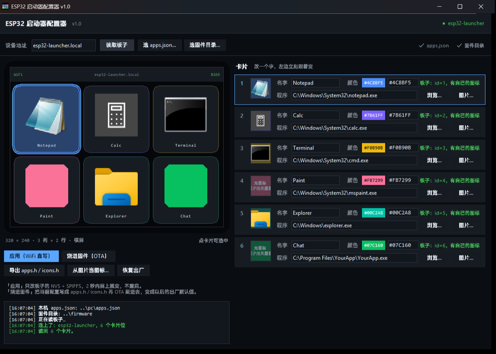

# ESP32 触摸屏程序启动器

在一块 **ESP32-2432S028R（俗称 Cheap Yellow Display / CYD）** 上显示 6 个电脑程序的卡片，
手指点一下，电脑上对应的程序就会被启动（已经在跑就切到前台，不会重复开）。

> **只想下配置器？** [Releases](https://github.com/misila122/esp32-launcher/releases/latest)
> 里有打包好的单文件 exe，免安装、不需要 Python。固件要自己编（原因见
> [桌面配置器](#4-桌面配置器图形界面改卡片可选)那一节）。

```
┌──────────────────────┐   WiFi 局域网   ┌───────────────────────────┐
│  ESP32 + 2.4" 触摸屏  │ ───────────────▶│  电脑上的常驻小服务        │
│  TCP 服务端 :8266     │   LAUNCH <id>   │  launcher_server.py       │
│  UDP 应答   :8267     │ ◀───────────────│  启动/切前台对应程序       │
└──────────────────────┘   OK/ERR <id>    └───────────────────────────┘
```

**为什么是 ESP32 当服务端、电脑主动连过去？**
这样电脑只做出站连接，Windows 防火墙不会拦，**不需要管理员权限、不用加防火墙规则**。
反过来的话就得给电脑加入站规则了。

---

## 目录结构

```
esp32-launcher/
├─ .gitignore                    挡住 secrets.h / apps.json / 日志 / 产物
├─ firmware/                     ESP32 固件（PlatformIO 工程）
│  ├─ platformio.ini
│  ├─ src/
│  │  ├─ main.cpp                UI + 通信协议 + 串口调试
│  │  ├─ board.h                 各开发板的引脚/屏幕/触摸配置（profile 切换）
│  │  ├─ config.h                端口、握手 token、UI 参数
│  │  ├─ apps.h                  6 个卡片的名称/颜色/程序 id（出厂默认值）
│  │  ├─ appstore.h              运行时配置层：把卡片从 NVS + SPIFFS 读出来
│  │  ├─ prov.h                  扫码配网：SoftAP + 强制门户 + 账号读写
│  │  ├─ icons.h                 6 个卡片的图标位图（机器生成，别手改）
│  │  └─ secrets.h.example       WiFi 账号模板 —— 复制成 secrets.h 再填
│  └─ backup/                    放原厂固件备份的地方（不进版本库）
├─ pc/                           电脑端
│  ├─ launcher_server.py         常驻服务（纯标准库，无第三方依赖）
│  ├─ apps.json.example          6 个程序的路径模板 —— 复制成 apps.json 再填
│  ├─ install.ps1                装成"登录后自动启动"的计划任务
│  └─ logs/agent.log             运行日志
├─ configurator/                 桌面配置器（图形界面改卡片，可选）
│  ├─ esp32_configurator.py      主程序（标准库 + tkinter，无第三方依赖）
│  ├─ ui.png                     界面截图（README 引用）
│  ├─ build_exe.ps1              打成单文件 exe
│  ├─ make_icon.py               画 exe 用的图标
│  ├─ _selftest.py               不用板子的逻辑自检
│  ├─ _e2e.py                    对真板子跑一遍 8269 协议（--reboot 验持久化）
│  ├─ _gui_test.py               不开窗口，直接驱动界面代码路径
│  ├─ _bake_test.py              「烧进固件」全流程（会真的重写头文件 + OTA 一次）
│  ├─ _latency_test.py           导出降级路径 + 「应用」延迟实测
│  ├─ _powercycle_test.py        重启后配置还在不在（有串口就拉 EN 脚做硬件复位）
│  ├─ _bye_test.py               连接稳健性回归（BYE / 连开连关 / 空闲超时）
│  ├─ _icon_dump.py              把板子上六格真正在用的图标读回来拼成对比图
│  ├─ _qr_check.py               把屏上那张配网二维码读回来重建 + 用 OpenCV 真解码
│  ├─ _prov_test.py              扫码配网全流程：开网页 -> 提交账号 -> 确认读了 NVS
│  └─ dist/ESP32-Launcher-Configurator.exe   打包产物（不进版本库）
└─ tools/                        一次性用的辅助脚本（见文末）
```

> **下面所有命令都假设当前目录是项目根目录**（就是 clone 下来的这个 `esp32-launcher/`），
> 所以路径一律写成 `firmware/…`、`pc/…` 这种相对形式。
>
> 两个"要你自己填"的文件不在版本库里，第一次用要先复制模板：
> `firmware/src/secrets.h.example` → `secrets.h`、`pc/apps.json.example` → `apps.json`。
> 不过 **`secrets.h` 完全可以不填** —— 用手机扫码配网就行（见第二节）。

---

## 一、硬件

| 项目 | 值 |
|---|---|
| 型号 | **ESP32-2432S028R**（CYD） |
| 芯片 | ESP32-D0WD-V3 (rev v3.1)，双核 240MHz，40MHz 晶振 |
| Flash | 4MB，无 PSRAM |
| 屏幕 | ILI9341 **240×320（竖屏）**，SPI |
| 触摸 | XPT2046 电阻屏，独立 SPI 总线 |

屏幕引脚：`SCLK 14 / MOSI 13 / MISO 12 / CS 15 / DC 2 / RST -1 / 背光 21`
触摸引脚：`SCLK 25 / MOSI 32 / MISO 39 / CS 33 / IRQ 36`（`board.h` 里 profile 1）

> 换板子只改 `firmware/platformio.ini` 里的 `-DBOARD_PROFILE=n`，
> n 对应 `firmware/src/board.h` 里第 n 套配置（共 5 套：CYD / 通用 ILI9341+XPT2046 /
> ST7789+FT6236 / 1.14" ST7789 无触摸 / ST7796+XPT2046）。

> **这块屏只能写、不能读。** 试过用 `tft.readPixel()` 回读屏幕内容来自检渲染，
> 结果三个纯色（红/绿/蓝）全读回同一个值 `00A3`，两个几乎一样的深色却读出 `00EC` 和
> `00A3` —— 是噪声，不是像素。CYD 的屏幕 SDO 没接到 ESP32 上，**所以别想着用电学手段
> 验证画面**，屏幕画得对不对只能用眼睛看。（触摸那一路的 MISO 39 是好的，能正常读。）

### 屏幕方向 / 反色（编译期固定，改完要重烧）

**启动器固定跑横屏 320×240，方向和反色都在固件里写死。** 早期版本允许在自检画面上
点一下换朝向、并把结果存进 NVS；但触摸误判时会把横屏切回竖屏，还把这个错误值**持久化**
下来，所以持久化去掉了 —— `dispLoadNvs()`（`main.cpp:121`）每次开机主动删掉 NVS 里的
`disp/off`、`disp/rot`、`disp/inv`、`disp/ver`，一律采用编译期的值。

改方向 / 反色就改这三处，然后重新烧一次：

| 参数 | 在哪 | 说明 |
| --- | --- | --- |
| `SCREEN_ROTATION` | `firmware/platformio.ini` 的 `-DSCREEN_ROTATION=n`（`board.h:27` 有 `#ifndef` 兜底） | `0` = 竖屏（240×320）、`1` = 横屏（320×240） |
| `PANEL_OFFSET_ROTATION` | `firmware/src/board.h:49` | 面板 `offset_rotation` `0..7`，见下面 |
| `TFT_INVERT` | `firmware/src/board.h:50` | `0` / `1`，整个画面颜色反色 |

**想在烧录之前先把值试出来**，用串口（见「串口调试指令」的 `o` 系列）：

```
o p <0-7>   面板 offset_rotation      o r <0-3>   逻辑 rotation
o i         反色开 / 关                o d         全部恢复成编译期默认值
```

这四个**当场生效、并把画面重画一遍**方便看效果，但**都不写 flash** —— 重启就回到编译期
的值。这正是它们的用途：试对了再把数字抄进 `board.h` / `platformio.ini`。

开机那 20 秒的自检画面上，点一下 / 按住也能临时换朝向和反色（画面上的 `TAP = rotate` /
`HOLD = invert`），同样是**内存里改一改、不持久化**，重启就还原。因为触摸误判会误触发，
别把它当成设置入口用。

判据是画面上那个**大向上箭头**：不管文字看不看得懂，箭头朝上就说明方向对了。反色不对就
看中间那两个方块 —— 标 `WHITE` 的应该是纯白、标 `BLACK` 的应该是纯黑。

#### 为什么这块板是 `offset_rotation = 0` 而不是官方识别器那个 2

`offset_rotation` 的 8 个值不是"8 个旋转"，而是 **4 个旋转 × 2 个翻转态** ——
`Panel_LCD.inl:132` 的注释写得很明白：

```
offset_rotation の加算 (0~3: 回転方向、 4: 上下反転フラグ)
```

即 **bit0/bit1 是旋转量，bit2（值 4）是"上下翻转"标志位**。所以 `offset_rotation` 配合
逻辑 rotation 一共能表达 8 种朝向，"画面上下颠倒"这种既不是 0/90/180/270 的症状也在
覆盖范围内。

LovyanGFX 自带的 CYD 识别器 `_detector_Sunton_2432S028_9341_t`
（`LGFX_AutoDetect_ESP32_all.hpp:3169`）用的是 **2**，但**这块板实测是 0**。这几个值
是拿照片一轮轮试出来的 —— 2 和 4 分别对应 180° 和纯上下翻转，都对不上，最后落在
`offset_rotation = 0` + `SCREEN_ROTATION = 1` + `TFT_INVERT = 1`。换板子的话按上面的
`o` 系列重试一遍。

- 卡片网格会自己跟着屏幕方向变：横屏 3 列 × 2 行，竖屏 2 列 × 3 行。
- 改方向**不需要重新标定触摸** —— 面板和触摸是一起转的。已实测：`offset` 从 2 换到 4
  之后，喂进同一套标定对应的裸 ADC，解出来的屏幕坐标仍然精确落回靶心
  （`raw(691,485) -> screen(25,26)`、`raw(3508,3415) -> screen(212,294)`）。

### 开机自检画面（20 秒）

每次上电（或拔插 USB）会先显示 20 秒自检画面，然后自动切到卡片界面。这块画面有两个
用途：**看不清方向时判断朝向**，以及**临时试着换方向 / 反色**（改了不持久化，见上一节）。
一眼能判四件事：

- 顶部一个**大向上箭头** —— 语言无关的方向判据，箭头朝上就是对的
- 整屏一圈白边框 —— 没铺满 / 有回绕会立刻看出来
- 中间左边一个**纯白**方块（标 `WHITE`）、右边一个**纯黑**方块（标 `BLACK`）——
  颜色反了的话这两个会互换
- `LEFT` / `RIGHT` / `BOTTOM` 三个词，以及参数回显 `320x240 r1 o0 v1`（依次是屏幕尺寸、
  逻辑 `rotation`、面板 `offset_rotation`、反色），还有 R G B Y C M 六个色块 ——
  色块顺序不对说明 RGB/BGR 通道反了

网络参数：板子默认走 DHCP，地址看路由器分配（串口日志里有，也能用 `esp32-launcher.local`）。
想固定 IP 就在 `secrets.h` 里定义 `STATIC_IP` / `STATIC_GW`。
TCP `8266`、UDP `8267`、mDNS 名字 `esp32-launcher.local`。

---

## 二、编译和烧录固件

前置：Python 3.9+ 和 PlatformIO（`python -m pip install platformio`）。

```powershell
cd firmware
python -m platformio run              # 只编译
python -m platformio run -t upload    # 编译 + 烧录（会自动找 COM 口）
python -m platformio device monitor   # 看串口输出（Ctrl+C 退出）
```

刷完的占用：RAM 约 16%、Flash 约 49%（分区表是 `min_spiffs.csv`，app0 分区 1920 KB）。

> **注意**：每次用工具打开 COM5（包括 `device monitor` 和下面的 `serial_cli.py`），
> 板子都会自动复位一次 —— 这是 USB 串口芯片的 DTR/RTS 复位电路导致的，属正常现象。

### WiFi 账号

把 `firmware/src/secrets.h.example` 复制成 `firmware/src/secrets.h`，填自己的 2.4G 账号
（**这个文件在 `.gitignore` 里，不会被提交**）：

```cpp
#define WIFI_SSID     "你的WiFi名字"
#define WIFI_PASSWORD "你的WiFi密码"
```

**也可以完全不填** —— 下一节的扫码配网就是干这个的，手机扫一下把账号存进板子就行。
`config.h` 里对这两个宏做了兜底（`#if __has_include("secrets.h")` + `#ifndef`），
所以**没有 `secrets.h` 也能编译**。

连不上会重试 40 次然后重启，一直循环。

### 用手机扫码配网（不用改代码、不用插线）

开机自检画面上会画一个二维码，**用手机相机直接扫**：

- 二维码里是 `WIFI:T:WPA;S:<热点名>;P:<密码>;;` 这种标准格式，**扫一下手机就自动连上板子的热点**，不用手输密码。
- 连上之后系统一般会自己弹出配置页（"此网络需要登录"）。没弹就用浏览器打开 **`http://192.168.4.1/`**。
- 页面上选一个 WiFi（下拉框按信号从强到弱排好，只列 2.4G 的）、填密码、点保存。板子存进 NVS 后自己重启，然后就用新账号连。
- 板子热点名是 `esp32-launcher-` 加 MAC 后两字节，例如 `esp32-launcher-A1B2`，密码固定 `launcher123`（在 `config.h` 的 `PROV_AP_PREFIX` / `PROV_AP_PASS`）。

几条要知道的：

- **热点什么时候开着**：开机就开。连上 WiFi 之后**再留 30 秒**（这期间有手机连着就不关），之后自动关掉省得占着信道；**从来没连上过就永远开着** —— 那是最后的救急入口。
- **配网页也能从局域网打开**：`WebServer` 绑的是所有网卡，所以 `http://<板子IP>/` 一样能开。热点关了以后就用这个。
- **账号优先级**：NVS 里有就用 NVS 的，没有才退回 `secrets.h`。所以老固件升上来行为不变；手机配过一次之后就以手机配的为准。
- **想退回 `secrets.h`**：串口发 `w clear`，再发 `z` 重启。
- **配网搞砸了也能救**：账号存错连不上时板子永远连不上 → 热点就永远开着 → 再扫一次二维码重配就行。

**代码在哪**：`firmware/src/prov.h`（热点、DNS 劫持、网页、账号读写）、`firmware/src/main.cpp` 的 `drawQRAt()` / `qrEncode()`（二维码排版）、`config.h` 的四个 `PROV_*` 宏。

**怎么自己验一遍**（不打扰用户、不用手机）：

```powershell
cd configurator
python _qr_check.py <板子IP>      # 把屏上那张二维码读回来重建成 PNG，用 OpenCV 真解码
python _prov_test.py <板子IP>     # 重启 -> 开配网页 -> 提交账号 -> 确认重启后真的读了 NVS
```

8269 上还有几个自检指令：`PROV`（看热点状态和二维码文本）、`PROV QR`（把二维码模块矩阵原样吐出来）、`PROV SCAN`（板子扫一遍周围网络）、`PROV WEB`（板子自己 GET 一遍配网页，看状态行和耗时）。

> **踩过的坑**：`ricmoo/QRCode` 这个库**不检查数据长度**。`qrcode_initBytes()` 只在
> `encodeDataCodewords()` 返回负数时报错，而那个函数三种模式全都无条件返回正数；
> 底下的 `bb_appendBits()` 也完全不看容量，超长时直接往定长栈数组外面写。
> 实测 48 字节的 `WIFI:` 串配 version 2（数据区只有 45 字节）——它返回 0（"成功"）、
> 编出一张 OpenCV 直接抛异常的坏图、还踩了 4 字节栈。
> 所以 `qrEncode()` 里有一张**自己维护的字节容量表**，版本一律按表挑，别改回"靠返回值判断装不装得下"。
> 这也是 `_qr_check.py` 存在的理由：二维码在屏上是只写的，编错了我看不见。

### 不插线刷固件（OTA）

装好 OTA 之后，以后改界面就不用再插数据线了：

```powershell
cd firmware
python -m platformio run -e ota -t upload
```

原理：PlatformIO 走 `espota` 协议，先 UDP 邀请板子（端口 3232、密码 `launcher-ota`），
认证通过后**板子反向 TCP 连回电脑**接收固件。

| 项 | 值 |
|---|---|
| 目标地址 | `esp32-launcher.local`（mDNS；解析不了就改 `platformio.ini` 里的 `upload_port` 直接写 IP） |
| OTA 端口 / 密码 | `3232` / `launcher-ota` |
| 分区表 | `min_spiffs.csv`（app0 + app1 各 1920 KB） |

> **为什么换了分区表**：原来沿用的 `huge_app.csv` 里只有 `app0`、**没有 `app1`**，
> OTA 没有可写的备用槽位，推上去也没地方落。`min_spiffs.csv` 的 `nvs` 分区位置
> 和 `huge_app.csv` 完全一样（都在 `0x9000`、大小 `0x5000`），所以**换表不会丢触摸标定**。

**第一次跑有可能超时**，报 `[ERROR]: No response from device` —— 这一步是板子反向连回电脑，
首次偶发不通；**原样再跑一遍就行**（实测第二次 32 秒成功，板子正常重启并连回电脑端服务）。
如果连跑几次都不通，检查板子和电脑是不是在同一个局域网、电脑防火墙有没有拦入站 TCP。

> **OTA 救不了什么**：它只能覆盖"改界面重烧 / USB 口接触不良 / 传到一半断电"。
> **要是刷进一个开机就崩的固件（典型：WiFi 连不上），还是得插 USB 线救** ——
> 本项目没开 bootloader 回滚。所以推 OTA 之前，先确认新固件在本机编译通过、
> 且没有动 `secrets.h` 里的 WiFi 账号。

---

## 三、电脑端

### 1. 改程序清单

把 `pc/apps.json.example` 复制成 `pc/apps.json`（**这个文件在 `.gitignore` 里**），改成自己的：

```json
{
  "apps": [
    { "id": 1, "label": "Notepad", "path": "C:\\Windows\\System32\\notepad.exe" }
  ]
}
```

- `id` 必须和固件 `src/apps.h` 里的 `id` 一一对应（1~6）。
- `label` 是屏幕卡片上的文字，**目前只支持英文/数字**（中文要另外做字库，见文末"还能做什么"）。
- `path` 写 exe 全路径就行。有些程序（游戏启动器、聊天软件很常见）点的那个 exe 只是个壳，
  真正持有窗口的是它的子进程 —— 服务会按路径分层打分去找那个真进程，不会重复启动。

### 2. 手动跑

```powershell
cd pc
python launcher_server.py            # 前台运行，日志直接打在屏幕上
python launcher_server.py --list     # 只检查 6 个路径存不存在
python launcher_server.py --once 3   # 直接启动 id=3（不联网，纯测试）
```

### 3. 装成开机自启（推荐）

> **需要管理员权限。** 服务要以管理员身份运行，否则点屏幕上的**某些程序**起不来 ——
> 清单里写了 `requireAdministrator` 的 exe（游戏启动器、部分硬件工具很常见），
> 低权限进程启动它会直接报 `WinError 740`（请求的操作需要提升）。

用**管理员身份**打开 PowerShell，然后：

```powershell
cd pc
powershell -ExecutionPolicy Bypass -File .\install.ps1
```

不想自己开管理员窗口，就在普通 PowerShell 里加 `-Elevate`，它会弹一次 UAC 提权重跑：

```powershell
.\install.ps1 -Elevate
```

会注册一个叫 `ESP32AppLauncher` 的计划任务，`RunLevel = Highest`，登录后自动以
`pythonw.exe` 无窗口后台运行。**服务自身是管理员时，再启动这类需要提权的程序就不会弹 UAC** ——
否则你每点一次屏幕都得跑回电脑上点一次「是」。

```powershell
.\install.ps1 -Status                                  # 看状态
Stop-ScheduledTask -TaskName ESP32AppLauncher          # 临时停
Start-ScheduledTask -TaskName ESP32AppLauncher         # 再启动
.\install.ps1 -Remove                                  # 彻底卸载
```

> **改运行级别后必须停掉旧实例。** 计划任务的运行级别只在**启动时**读取，
> 光用 `-Force` 重新注册，已经在跑的那个进程仍保持原权限。表现是日志里出现
> `launched elevated via ShellExecute`（服务自己发现 740，又走了 UAC 兜底）。
> `install.ps1` 已经会自动先停旧实例；手动操作时要自己 `Stop-` 再 `Start-`。

日志：`pc\logs\agent.log`（用 `Get-Content -Encoding UTF8` 看，否则中文乱码）。
启动横幅里有一行 `权限` 会直接告诉你服务是不是管理员：

```
  权限    : 管理员（点需要提权的程序不会弹 UAC）
```

### 4. 桌面配置器（图形界面改卡片，可选）

上面 `### 1.` 改的是**电脑端开哪个程序**，这一节改的是**板子上那张卡片长什么样** ——
名字、主题色、图标、以及它对应哪个程序 id。不用改文件、不用重编译，点一下「应用」两秒生效。

```powershell
cd configurator
python esp32_configurator.py                                  # 直接跑源码
.\dist\ESP32-Launcher-Configurator.exe                        # 或者跑打包好的单文件 exe
.\dist\ESP32-Launcher-Configurator.exe --ip <板子IP>           # 顺便预填板子地址
```

exe 是自包含的（标准库 + tkinter，**不需要装 Python**），可以直接拷到别的 Windows 电脑双击运行。
不想自己打包的话去 [Releases](https://github.com/misila122/esp32-launcher/releases/latest)
下 `ESP32-Launcher-Configurator.exe` 就行。

> 那里**只有配置器，没有预编译固件**，是故意的：固件编译时会把 `firmware/src/secrets.h`
> 里的 WiFi 账号直接编进 `.bin`，编译路径里还带着构建者的用户名 —— 这两样都不适合放进
> 公开产物。固件照上面「编译和烧录固件」自己编一次就好。



界面分两栏：**左边是那块屏**，右边是六张卡的编辑区。

**左栏（从上到下）**

| 位置 | 说明 |
|---|---|
| 面板预览 | 按固件的真实几何 1.5 倍重画的 320×240 画面 —— 状态栏、六张卡、真图标、标签位置。改右边任何一个字，这里立刻跟着变。点卡片可以选中它（选中的那张外面套一圈蓝边）|
| 应用（WiFi 直写）| 写进板子的 NVS / SPIFFS 并立刻重画，**不重启**。整个界面**只有这一个实心按钮**，因为它是最常用的动作 |
| 烧进固件（OTA）| 重新生成 `apps.h` / `icons.h` 并跑一次 OTA 烧录，变成新的出厂默认值 |
| 导出 apps.h / icons.h | 本机没有固件目录时，导出这两个头文件拿别处编译 |
| 从图片当图标… | 手动挑 png / ico 当图标（默认是**自动从 exe 里抠**）|
| 恢复出厂 | 清掉板子上存的配置，回到 `apps.h` 里的编译期默认值 |
| 日志 | 设备连接、读写结果、OTA 进度都在这儿 |

**右栏**：卡片 1~6，每张两行 —— 上面是「名字 + 主题色」，下面是「程序路径 + 浏览…/图片…」。
选中哪张，左栏预览里那张就亮起来；点预览里的卡片也能反过来选中右边的编辑区。

**顶栏**：设备地址（默认 `esp32-launcher.local`，走 mDNS，填 IP 也行）、`读取板子`
（把板子当前的 6 格配置拉回来填进界面）、`选 apps.json…`（读电脑端的 `pc/apps.json`，
自动按 id 对上程序路径）、`选固件目录…`（指到 `firmware/`，「烧进固件」才能用）。
最右边两个 `✓/✗` 就是「这两个路径找到了没有」—— 决定「烧进固件」按下去会不会成功。

**两种保存方式的区别**（这是这个配置器的核心）：

- **应用** = 只写板子的 NVS（名字/颜色/id）和 SPIFFS（图标），**立刻生效、不重启、
  不动固件**。缺点是整片擦除或换板子就没了。
- **烧进固件** = 把当前界面上的六张卡写回 `firmware/src/apps.h` + `icons.h`，再
  `python -m platformio run -e ota -t upload` 刷进去。这才是"永久固化"，
  以后恢复出厂 / 换板子都是这一套。

**改不了的**：卡片数量固定 6 张（`APP_COUNT` 是编译期常量）；「启动参数」「工作目录」
仍然只在 `pc/apps.json` 里配 —— 板子只负责发一个 `LAUNCH <id>`。

> 配置走的是**独立的 8269 端口**，不是常驻服务那条 8266。
> 因为 8266 是**单客户端**的，配置器挤进去会把常驻服务顶掉、两边互相重连。
> 独立端口还有个好处：仍然是"电脑连板子"的**出站**连接，**不需要管理员权限、不用加防火墙规则**。

图标是**从程序自己的 exe 里抠出来的**（读 PE 资源段，纯标准库，不需要 Pillow），
抠完缩到 64×64、转成 RGB565，和固件里的 `icons.h` 同一套格式。

**配置器自己的图标**（`app.ico`，由 `make_icon.py` 生成）画的就是**那块板子本身**：
圆角黑边框 + 4:3 的屏幕 + 屏幕上按固件真实几何排的六张彩色卡片 + 状态栏那颗绿点。
几何（`320×240`、状态栏 `22`、卡片 `3×2`、tile0 在 `(6,28)`、每张 `98×100`、间距 `6`）
和颜色（`C_BG` / `C_TILE_EDGE` / `C_OK` / `apps.h` 里那六个应用色）全部是从
`firmware/src/main.cpp` 和 `apps.h` 抄过来的 —— **改固件的几何或配色时记得同步
`make_icon.py`**，否则图标会和真机对不上。16 像素那一档只画六个方块不画状态栏，
因为再多的细节在那个尺寸上只会糊成一个脏点。`python _icon_preview.py 128` 可以把
任意一档解成 PNG 肉眼核对。

打包 / 自检：

```powershell
powershell -ExecutionPolicy Bypass -File build_exe.ps1     # 产物在 dist\
.\dist\ESP32-Launcher-Configurator.exe --selftest           # 不开窗口，验证 exe 完整
python .\_selftest.py                                       # 不用板子的逻辑自检
python .\_e2e.py <板子IP>                                # 对真板子跑一遍 8269 协议
python .\_e2e.py <板子IP> --reboot                       # 顺带验证重启后配置还在
python .\_gui_test.py <板子IP>                           # 不开窗口，直接驱动界面代码路径
python .\_bake_test.py <板子IP>                          # 「烧进固件」全流程（会真的 OTA 一次）
python .\_latency_test.py <板子IP>                       # 导出降级路径 + 「应用」到底多快
python .\_powercycle_test.py <板子IP> COM5               # 重启后配置还在不在
python .\_bye_test.py <板子IP>                           # 连接稳健性（详见下面的坑）
python .\_icon_dump.py <板子IP> board_icons.png          # 板子上的图标 vs 本机抠的，拼一张图
python .\_qr_check.py <板子IP>                            # 把板子上的配网二维码读回来重画 + 真解码
python .\_prov_test.py <板子IP>                           # 走一遍配网页「保存账号」，验证真用上了
python .\_gui_shot.py <板子IP>                            # 开个真窗口连板子读一遍，留着截图用
python .\_icon_preview.py 128                                # 把 app.ico 的某一档解成 PNG，肉眼核对
```

实测数字（供参考）：**点「应用」到板子真的变，0.3 秒左右**；从 8269 读回六格
0.1 秒；「烧进固件」整条链路约 40 秒（大头是 PlatformIO 编译）。

> **怀疑"配置器显示对了、板子上却是另一张图"时，跑 `_icon_dump.py`。**
> `GET` 只回一个 `iconFs` 标志（有没有自定义图标），不回图标本身，所以从电脑这边
> 看不出板子上到底画的是什么。`_icon_dump.py` 走的是固件的 `GICON <i>` 指令 —— 把
> 第 i 格**当前真正在用的** 8192 字节位图读回来 —— 拼成上下两排（上排板子、下排本机）
> 的 PNG，一眼就能看出对不对。

> **踩过的坑：8269 只有一个连接槽位。** 板子的 `WiFiServer` 同一时刻只认一个客户端，
> 而 TCP 的 FIN 要等板子下一次 `recv` 才发现 —— 中间新来的连接会被晾在 backlog 里，
> 最后收到 `WinError 10054 远程主机强迫关闭了一个现有的连接`。
> 所以客户端每次关连接前都会发一句 `BYE`（板子收到就立刻释放槽位），
> 板子那边还有 30 秒空闲超时兜底，客户端 `connect()` 也自带 3 次重试。
> `_bye_test.py` 就是守这个回归的。
>
> 顺带一提：**合成鼠标点击 tkinter 按钮是不可靠的**（UIA 树里只暴露没标签的 Button，
> PostMessage 和 SendInput 两条路都点不动 `读取板子`）。`_gui_test.py` 改成
> 直接调 `App.do_read()` / `App.do_apply()` 并用 `root.update()` 泵事件循环 ——
> 测的是同一批函数，还稳定。

---

## 四、通信协议

### 1. 点卡片（8266，常驻服务用）

电脑连上 ESP32 的 8266 端口后，双方按行发 UTF-8 文本：

| 方向 | 报文 | 说明 |
|---|---|---|
| PC → ESP32 | `HELLO <token> <电脑名>` | 握手（token 在 `apps.json` 的 `device.token`） |
| ESP32 → PC | `WELCOME <设备名>` | 握手成功 |
| ESP32 → PC | `LAUNCH <id>` | 用户点了第 id 个卡片 |
| PC → ESP32 | `OK <id> <说明>` / `ERR <id> <原因>` | 执行结果，屏幕会显示 2.2 秒 |
| 双向 | `PING` / `PONG` | 每 20 秒心跳 |

找设备顺序：`apps.json` 里配的固定 IP → mDNS（`esp32-launcher.local`）→ UDP 广播 `ESP32LAUNCHER?`。

> 这个端口**同一时刻只服务一个客户端**（常驻服务独占）。所以配置器不用它。

### 2. 改卡片（8269，桌面配置器用）

还是按行发 UTF-8 文本，`HELLO` 之后才能用别的指令：

| 方向 | 报文 | 说明 |
|---|---|---|
| PC → ESP32 | `HELLO <token>` | 握手，token 同上（`esp32launcher`） |
| ESP32 → PC | `OK <设备名> <卡片数>` | 握手成功 |
| PC → ESP32 | `GET` | 要当前六格配置 |
| ESP32 → PC | `APP <i> <id> <0/1> <rrggbb> <名字>` | 每格一行（`<0/1>` = 图标是不是存在 SPIFFS 里）；最后一行是 `END` |
| PC → ESP32 | `SET <i> <id> <rrggbb> <名字...>` | 改第 i 格。名字可以带空格，取到行尾。**只改内存，不落盘** |
| PC → ESP32 | `ICON <i> <字节数>` | 声明要传图标，字节数必须是 8192 |
| ESP32 → PC | `READY` | 可以发了；紧接着就是 8192 字节**裸二进制**（RGB565 小端，64×64） |
| ESP32 → PC | `OK icon` | 收全了。超时 15 秒会回 `ERR icon timeout` 并删掉半截文件 |
| PC → ESP32 | `GICON <i>` | 把第 i 格**当前真正在用的**图标读回来 → `OK 8192`，紧接着 8192 字节裸二进制 |
| PC → ESP32 | `COMMIT` | 把内存里的配置写进 NVS 并重画屏幕 → `OK saved` |
| PC → ESP32 | `CLEAR` | 清掉 NVS + SPIFFS，回出厂默认值 → `OK defaults` |
| PC → ESP32 | `BYE` | 道别。**强烈建议发**：这个端口只有一个槽位，不发的话下一次连接可能撞上 RST |
| PC → ESP32 | `PING` → `PONG` | 探活 |

出错一律回 `ERR <原因>`（`bad token` / `args` / `range` / `size` / `no fs` / `fs open` / `unknown`）。

> **为什么单开一个端口**：8266 是单客户端的，配置器挤进去会把常驻服务顶掉、两边互相重连。
> 8269 独立之后两边零争用，而且仍然是"电脑连板子"的**出站**连接，
> **不需要管理员权限、不用加防火墙规则**。
>
> 板子这边还有 30 秒空闲超时兜底：配置器崩了 / 网络断了也不会把唯一那个槽位永久占住。

---

## 五、串口调试指令

因为没法用手去点屏幕，固件内置了几个串口命令（115200 8N1，发一行一回车）：

| 指令 | 作用 |
|---|---|
| `?` | 列出全部指令 |
| `s` | 打印状态：`wifi / IP / PC链接 / 内存`，以及当前触摸标定、IRQ、SPI 模式 |
| `l <id>` | **模拟点击**第 id 个卡片（等价于手指点下去） |
| `l <x> <y> [毫秒]` | 在屏幕坐标合成一次点击，走**完整**的命中判定链路；第三个参数是按住时长，`>=5000` 会进标定向导 |
| `l raw <rx> <ry> [毫秒]` | 直接喂一对**触摸芯片裸 ADC 值**（合成屏幕坐标喂不进标定向导，它读的是裸值）。只在写固件自测时用得到 |
| `t` | 开关"标定后坐标"打印：`[TOUCH] x=.. y=.. tile=..` |
| `r` | 开关"触摸芯片原始值"打印：`[RAW] x=.. y=.. size=..` |
| `p` | 开关**原始 SPI 采样**（绕过 LovyanGFX 的过滤，能看到"没碰"时的真实读数）|
| `p <引脚>` | **CS 对照实验**：拿别的引脚当 CS 读一次，和真 CS 对比（排查触摸芯片到底在不在）|
| `c` | 进入/取消**触摸标定向导**（见下一节） |
| `b <0-255>` | 调背光亮度 |
| `g` | 打印板子上**当前生效的卡片配置**：`spiffs` 好不好、有没有自定义、端口，以及每格的 `id / 颜色 / 有没有从 SPIFFS 读到图标 / 名字` |
| `g clear` | 清掉 NVS + SPIFFS 里的卡片配置，恢复 `apps.h` 的出厂默认值（同 `g reset`），并立刻重画 |
| `i` | 开关触摸 IRQ 引脚（默认关：每轮都真读一次 SPI，最保险） |
| `h` | 切换触摸走**软件 SPI**（默认，官方 CYD 配置）还是**硬件 SPI3** |
| `x` | 抹掉 NVS 里存的标定值（`z` 重启后生效） |
| `d` | 读屏幕控制器 ID（RDDID / RDDST）。**实测读不出可信型号**，只能确认 MISO 在回数据 |
| `o` | 打印当前显示设置（`off` / `rot` / `inv` / 触摸 `off` / 屏幕尺寸） |
| `o p <0-7>` | 改**面板** `offset_rotation`（bit2 = 上下翻转）。**立刻生效，但不存 NVS** |
| `o r <0-3>` | 改逻辑 `rotation`（0 = 竖屏 240×320，1 = 横屏 320×240）。同样只当场生效 |
| `o i` | 反色开 / 关（只当场生效） |
| `o t <0-7>` | 改**触摸** `offset_rotation`（只影响触摸，只当场生效） |
| `o d` | 显示设置恢复成编译期默认值 |
| `w` | 打印配网状态：热点开没开、叫什么、密码、配网页地址，以及二维码里那串 `WIFI:` 文本 |
| `w qr` | 重画一遍自检画面（顺手把二维码的版本和尺寸打到串口，编不出来会报"内容太长"）|
| `w clear` | **忘掉手机配网存过的那套账号**，重启后回退 `secrets.h`（发 `z` 重启生效）|
| `z` | 重启板子 |

> **显示方向只认编译期配置。** 这几个 `o` 指令是给你现场试出"哪个 `off` 值看着对"用的，
> 试出来之后把 `firmware/src/board.h` 里的 `SCREEN_ROTATION` / `PANEL_OFFSET_ROTATION` /
> `TFT_INVERT` 改成那个值再烧一次，就固定下来了。**重启即回到编译期配置**，
> 板子不会记住你临时试出来的值（早期版本会存 NVS，后来去掉了：省得"看着对了就忘了改代码"，
> 换块板子又不对）。

配套脚本 `tools/serial_cli.py`（需要 `pyserial`）：

```powershell
python tools\serial_cli.py --seconds 40 --at 25:"r"
# 打开串口抓 40 秒日志，并在第 25 秒发一条 'r'
```

> 注意：**每次打开串口都会复位板子**（DTR/RTS 复位电路），属正常现象。

---

## 六、触摸不准怎么校准

**不用改代码、不用重烧固件** —— 固件内置了一个标定向导，结果存进 NVS，下次开机自动生效。

### 怎么进去

- 串口发 `c`；**或者**
- 手指按在屏幕上**任意位置**别松手，坚持 5 秒（没有串口线时用这个）。

> **注意**：长按进向导**不要求你按在某张卡片上**。标定偏得厉害时，手指很可能落不到任何
> 卡片上 —— 要是还要求点中卡片，就永远进不去向导了。这是故意的。

### 先看触摸到底活没活着

**手指一碰屏幕，状态栏中间就会实时显示它认为你点在哪儿：**

```
tap 145,88 -> Notepad      ← 触摸正常，而且命中了 Notepad 这张卡片
tap 12,200  no tile        ← 触摸正常，但这个位置不在任何卡片上（偏了/点在缝里）
（什么都不显示）             ← 触摸根本没被读到，是硬件或驱动问题，往下看"完全不响应"
```

这一条是专门用来分开「触摸坏了」和「标定偏了」的 —— 这两种情况在屏幕上原本长得一模一样。
松手后状态栏还会留一条同样的提示，串口里也会打印 `[UI] touch OK at 12,200  but no tile`。

进去之后屏幕会依次出现 3 个靶心：

| 步骤 | 屏幕提示 | 要做什么 |
|---|---|---|
| 1/2 | `CAL 1/2 - tap the dot` | 点左上角那个**黄点**（尽量点在圆心） |
| 2/2 | `CAL 2/2 - tap the dot` | 点右下角那个**黄点** |
| 校验 | `Check - tap the dot` | 点屏幕正中的**绿点** |

- 绿点点中了 → 屏幕显示 `Touch OK` 和新的标定值，已存进 NVS。
- 绿点点偏了超过 60 像素 → 屏幕显示 `Cal failed`，串口打印 `FAILED: ... -- old values restored`，
  **自动回滚到原来的标定值**，不会把好用的值弄坏。
- 前两次取样两次几乎点在同一个地方（两条轴都拉不开 200 个 ADC 单位）→ 同样拒绝并回滚，
  打印 `FAILED: samples too close -- old values restored`。防止"两次都糊在中间"算出一组离谱的值。
- 想中途退出：再发一次 `c`（或者再长按一次）。

串口会同步打印每一步的原始 ADC 值和算出来的新标定值，方便排查。下面是一段**实测**输出
（用 `l raw` 喂进一对与当前标定自洽的裸值，向导应当原样解回同一组值 —— 实际确实原样解回了）：

```
[CAL] start; old x 300..3900  y 3700..200  irq=0
[CAL] step 1: raw(3508,3415) screen(24,26) n=59
[CAL] step 2: raw(692,485) screen(288,209) n=60
[CAL] target screen (26,26)/(293,213) -> panel (213,26)/(26,293)
[CAL] raw (3508,3415)/(692,485)
[CAL] new x 300..3900  y 3700..200
[CAL] step 3: raw(2092,1945) screen(156,118) n=59
[CAL] verify got (156,118) want (160,120) -> OK
[CAL] saved to NVS
```

`saved to NVS` 之后重启会打印 `[CAL] from NVS: x ... y ...`，说明标定真的落到 flash 里了。

### 当前生效的标定值

出厂默认取自 LovyanGFX 官方的 CYD 识别器（`LGFX_AutoDetect_ESP32_all.hpp:3112-3139`），
在 `firmware/src/board.h` 的 profile 1 里：

```cpp
#define TOUCH_CAL_XMIN 300    // 面板原始方向 x=0   处的 raw x
#define TOUCH_CAL_XMAX 3900   // 面板原始方向 x=239 处的 raw x
#define TOUCH_CAL_YMIN 3700   // 面板原始方向 y=0   处的 raw y
#define TOUCH_CAL_YMAX 200    // 面板原始方向 y=319 处的 raw y
```

> **`YMIN > YMAX` 不是笔误。** 这块屏的触摸排线是反着贴的，官方配置就是这么写的。
> 这四个值是定义在**面板原始方向**（240×320 竖屏）上的，不是屏幕方向。

### 如果触摸完全不响应

**先做这一步**：手指按住屏幕任意位置，看**状态栏中间**有没有出现 `tap x,y ...`。

- 出现了 → 触摸是好的，问题在标定或命中判定，跳到第 2 步。
- 没有 → 触摸链路没通，从第 1 步开始。

按可能性从高到低排查（每步都在串口里看结果）：

1. `s` 确认 `irq=0`（IRQ 引脚关着，最保险）。
2. `t` 然后点屏幕 —— 有 `[TOUCH]` 输出说明触摸在工作，只是坐标不对 → 用上面的标定向导。
   完全没有输出 → 触摸链路没通，继续下一步。
3. `r` 然后点屏幕 —— 看 `[RAW]` 有没有数。有数但 `t` 没数 = 标定矩阵出了问题（可 `x` 抹掉重来）。
4. `h` 切到硬件 SPI3 再试（官方用软件 SPI，但个别板子硬件 SPI 更稳）。
5. **`p 33` 和 `p 12` 对比** —— 这是判断"触摸芯片到底在不在总线上"的决定性实验：

   ```
   >>> SEND: 'p 12'                          # 12 号脚没接任何东西，等于"没人应答"
   [CSTEST] cs= 12 x=   0 y=   0 | 00000000000000000000000000000000

   >>> SEND: 'p 33'                          # 33 号脚是真正的触摸片选
   [CSTEST] cs= 33 x=4095 y=   0 | E0000000007FF87FD0000000007FF87F
   ```

   - **两次读数不一样 → 触摸芯片活着，而且真的在回数据。**
     这说明硬件没问题，问题只可能在标定或面板排线，用 `c` 重新标定。
   - **两次读数一模一样（都是全 0）→ 芯片没有响应**，重点查触摸排线有没有插好、
     `board.h` 里的 `PIN_TOUCH_SCLK/MOSI/MISO/CS` 四个脚对不对。

   > 本机实测结论（2026-10）：`cs=12` 全 0、`cs=33` 有结构化数据，
   > 所以**触摸芯片是活的**；没碰屏幕时 `x` 顶到满量程 4095、`y=0`、压力 `z` 为负，
   > 正是 XPT2046 "没触摸"的标准特征，LovyanGFX 因此正确地报告"无触摸"。

> 想确认固件的坐标换算有没有抄错，看开机日志里这行：
> ```
> [CAL] selftest rot=1 off=0 panel targets (26,293) (213,26)
> ```
> 括号里是「屏幕左上靶心、右下靶心」各自换算到**面板原始方向**的结果
> （`screenToPanelSpace()`）。`tools/test_cal_math.py` 用同一套公式反着推一遍 ——
> 只要它**每一档 rotation 都能把标定值原样解回来**（输出里全是 `解回原值=True`），
> 就说明公式没抄错。脚本只在第一档打印靶心，所以数字不会和上面这行一样，对得上的是公式。

---

## 七、想刷回板子原来的固件

这块 CYD 出厂时刷的是 **NerdMiner** 挖矿固件。**动手刷本项目之前先整片备份**，
以后想刷回去就是一条命令（备份文件不进版本库，自己存好）：

```powershell
# 1) 趁原厂固件还没被覆盖，先整片读出来（4MB Flash => 0x400000）
python -m esptool --port COM5 --baud 921600 read-flash 0 0x400000 firmware\backup\original-4MB.bin

# 2) 想回去的时候整片写回去
python -m esptool --port COM5 --baud 921600 write-flash 0 firmware\backup\original-4MB.bin
```

> 备份里含有你原来那块板子的 WiFi 账号和 NVS 内容，**别提交到 git**（`.gitignore` 已经挡了
> `firmware/backup/`）。这台 CYD 的 NerdMiner 固件在网上也能下到，但自己 dump 的那份才是
> 100% 对得上你手上这块板子的。

---

## 八、排障

| 现象 | 原因 / 处理 |
|---|---|
| 屏幕亮了但 PC 状态一直是 `PC --` | 电脑端服务没跑，或不在同一个网段。看 `pc\logs\agent.log` |
| 点了卡片屏幕显示 `ERR ...` | 服务日志里会写具体原因（多半是 exe 路径变了） |
| 手指按下去状态栏显示 `tap 12,200  no tile` | 触摸是好的，但标定偏了 —— 长按 5 秒进标定向导（**按哪儿都行**） |
| 手指按下去状态栏什么都不显示 | 触摸完全没被读到。见第六节"如果触摸完全不响应" |
| 状态栏一闪 `tap too short (Nms)` | 那一下按得太快（< 60 ms）。正常点按即可 |
| 状态栏一闪 `moved off XXX` | 松手时手指已经滑到别的卡片上了。手别抖 |
| 点某个程序报 `WinError 740` / `ERR 5 spawn failed` | 服务不是管理员，而那个 exe 要提权。按第三节用 `.\install.ps1 -Elevate` 重装，**记得先停掉旧实例** |
| 点它每次都弹 UAC | 同上 —— 服务自己没提权，才会走 `ShellExecute "runas"` 兜底 |
| 提权后点了卡片却没反应 | 高权限进程抢低权限窗口焦点偶发失败。看日志是 `focused` 还是 `started`，`focused` 说明窗口找到了但没抢到前台，再点一次即可 |
| 屏幕**全黑但还能点**（点了能开程序） | 背光被清成 0 了。`Panel_Device.inl:64-71` 的 `Panel_Device::init()` 里有 `if (_light) { _light->init(0); }` —— 只要重新 init 一次面板，背光就归零。所以改显示参数**绝不能用 `_panel.init()` 重init**，`board.h` 的 `reinitPanel()` 只调 `setRotation()`（它自己会重写 MADCTL）。串口 `b 255` 可以当场把背光救回来 |
| 板子上的图标和配置器里显示的不是同一张 | 跑 `python .\_icon_dump.py <ip> board_icons.png` 看上下两排对不对。两种来源：① 某格 SPIFFS 里有旧图标（`GET` 里那格 `iconFs=1`）——在配置器里给这格重选图标后点「应用」覆盖掉；② `firmware\src\icons.h` 里那格是**纯色占位方块**——说明「烧进固件」是在界面还没抠完图标时点的。现在 `do_bake()` 会先补齐图标，补不上会在日志里用红字点名是哪几张卡 |
| 板子反复重启 | WiFi 连不上（40 次超时）。检查 `secrets.h` 里的 2.4G 账号 |
| 串口日志里 `addApbChangeCallback(): duplicate func=...` | LovyanGFX 的无害告警，忽略 |
| 日志里 `sdcard_mount(): f_mount failed` | 这块板子没插 SD 卡，忽略 |

---

## 九、还能做什么

- **卡片显示中文**：现在 `label` 只能是英文，因为没打包中文字库。
  做个只含所需汉字的 1bpp 小字库即可（比如应用名里那几个字）。
- **多屏/多设备**：`LINK_TOKEN` 是唯一的，改成每台一个就能区分。
- **加程序**：改 `apps.json` 的同时，`firmware/src/apps.h` 里的 `APPS[]` 也要加一项
  （id、label、程序 id、颜色），然后按下面这节重新生成图标并烧录。

### 换图标 / 加图标

图标是从每个程序自己的 `.exe` 里抠出来的真实图标（`RT_GROUP_ICON` 资源里最大的那一帧），
不是手画的。**仓库里那份 `firmware/src/icons.h` 是纯色占位方块** —— 出厂默认值故意不带任何
第三方图标（商标问题），你在配置器里给每张卡选好图标后点「烧进固件」它就会变成真图标。
想完全手工做一遍：

```powershell
# 1) 从 exe 里抠出图标（.png 或 .ico 都行）
python tools\extract_icon.py "C:\Windows\System32\notepad.exe" tools\icons\notepad.png
# 2) 缩到 64×64 并生成 C 头
python tools\mk_icons.py tools\icons firmware\src\icons.h --size 64 --preview tools\icons\preview.png
```

`mk_icons.py` 会写两个文件：`firmware/src/icons.h`（RGB565 位图）和
`tools/icons/preview.png`（六图拼一张，**先看这张确认抠对了再烧录**）。
它同时接受 `.png` 和 `.ico`，两种都在内存里解码，不需要装 Pillow。

两个设计要点：

- **透明是"颜色键"，不是 alpha 混合。** 每个图标里 alpha < 128 的像素被替换成品红
  `0xF81F`（`ICON_TRANSPARENT`），烧进去后用 `tft.pushImage(x, y, w, h, ICONS[i], ICON_TRANSPARENT)`
  贴图，那一色的像素被跳过。所以图标能干净地盖在**会变色**的卡片底色上（待机 / 按下 /
  成功 / 失败四种底色都试过），不会在背后留一块深色方块。品红是挑的 —— 六个真图标里
  一个都不含这个色。
- 单个图标 64×64 占 **8192 字节**，六个共 48 KB，直接算进 Flash（当前总共 30.3%）。

---

## 附：`tools/` 里的脚本

这些是当初搭环境时一次性用的，日常用不到，但换电脑重搭时能救命：

| 脚本 | 用途 |
|---|---|
| `parallel_dl.py` | 多连接分段下载器（慢源上 32 连接能快 15 倍） |
| `remote_zip_ls.py` | 只读远端 ZIP 的中央目录，不下载整个包就能看里面有什么 |
| `install_toolchain.py` / `install_framework.py` / `install_pkg.py` | 把下好的工具链/框架/库离线装进 `~/.platformio` |
| `analyze_dump.py` | 解析固件 dump 的分区表、扫板型字符串、导出 NVS 里的 WiFi 账号 |
| `confirm_board.py` | 确认 dump 里的板型是编译路径而不是随便一个字符串 |
| `serial_cli.py` | 抓串口日志 + 定时发指令 |
| `test_cal_math.py` | 纯算术自测：验证触摸标定的正/逆变换和 `solveTouchCal` 数学对不对（不碰硬件）|
| `hunt_touch_cal.py` | 在原厂固件 dump 里找触摸标定值（结论：原厂没存，只能实测）|
| `log_probe.py` | 排查"日志文件到底写到哪去了" |
| `extract_icon.py` | 纯标准库 PE 资源遍历，从 `.exe` 里抠最大的那个图标帧（`.png` / `.ico`）|
| `mk_icons.py` | 纯标准库 PNG/ICO 解码 + 缩放，生成 RGB565 的 `icons.h` 和预览拼图 |
| `speedtest.py` / `speedtest2.py` | 给下载源测速 |

---

## 许可

[MIT](LICENSE)。固件、PC 端服务、桌面配置器三部分同一个许可，拿去改、拿去卖都行，
只要保留版权声明。

第三方依赖各自算各自的：LovyanGFX（MIT）、[ricmoo/QRCode](https://github.com/ricmoo/QRCode)（MIT）、
arduino-esp32 核心（LGPL-2.1）、PlatformIO（Apache-2.0）。
